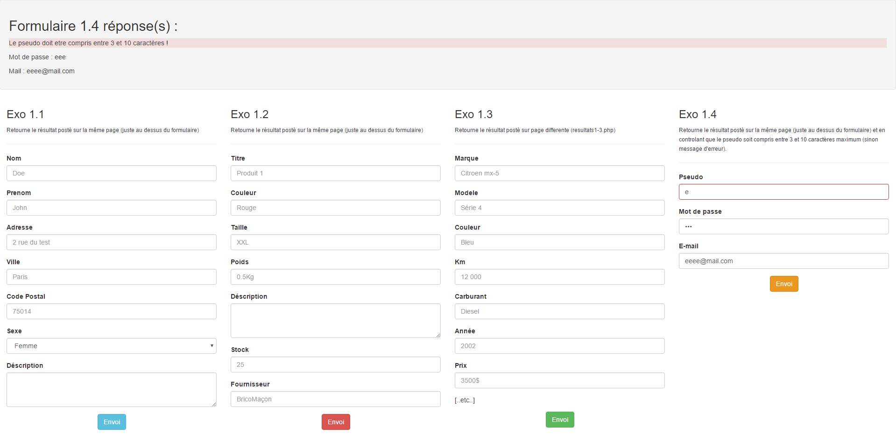
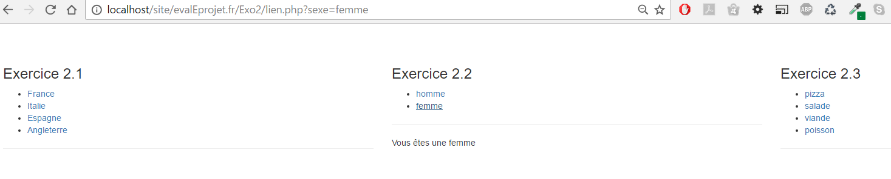
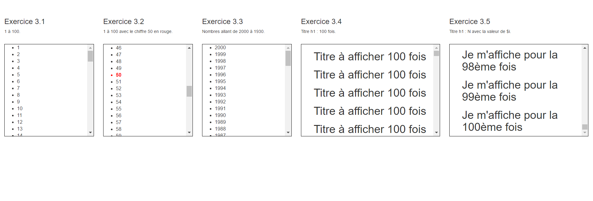
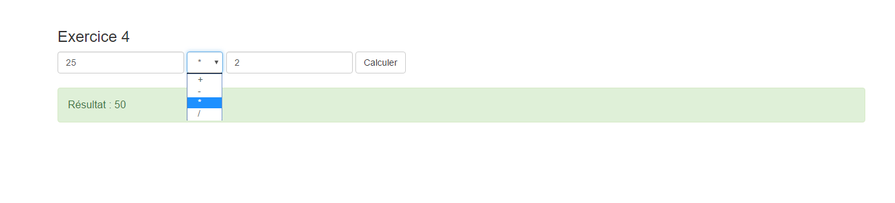
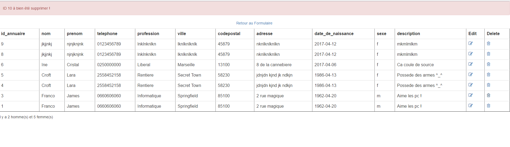

Exercices proposés par le site <a href="https://www.eprojet.fr/cours/php/20-php-evaluation" target="_blank">Eprojet.fr</a> :

:clock8: Temps d'étude : 10 jours. 
:date: Date de début : 30/03/2017 
:date: Date de fin éstimé : 09/04/2017 

<ul>
	<li>:open_file_folder: 20. Evaluation</li>
	<li>:pushpin: [✔] 20.01   Exercice 1 : Formulaire POST</li>
	<li>:pushpin: [✔] 20.02   Exercice 2 : Liens GET</li>
	<li>:pushpin: [✔] 20.03   Exercice 3 : Boucle</li>
	<li>:pushpin: [✔] 20.04   Exercice 4 : Calculatrice</li>
	<li>:pushpin: [✔] 20.05   Exercice 5 : Création d'un Repertoire</li>
	<li>:pushpin: [✘] 20.06   Exercice 6 : Création d'une Bibliothèque</li>
	<li>:pushpin: [✘] 20.07   Exercice 7 : Création d'une console</li>
	<li>:pushpin: [✘] 20.08   Exercice 7 : ATELIER - Création d'un site web complet</li>
	<li>:pushpin: [✘] 20.09   Exercice 7.1 : Les pages web côté FRONT</li>
	<li>:pushpin: [✘] 20.10   Exercice 7.2 : Les pages web côté BACK</li>
</ul>

<h3>Exercice 1 : Formulaire POST</h3>

<h3>Exercice 2 : Liens GET</h3>

<h3>Exercice 3 : Boucle</h3>

<h3>Exercice 4 : Calculatrice</h3>

<h3>Exercice 5 : Création d'un Repertoire</h3>
